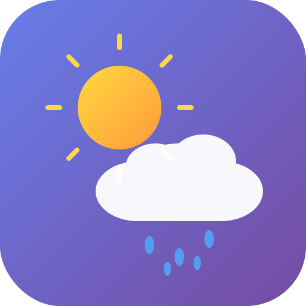

# Weather Expectations PWA ☀️🌧️

A beautiful, easy-to-use Progressive Web App for checking weather forecasts based on your location.



## Features

- 🌍 **Auto Location Detection** - Automatically detects your location using GPS
- 🔍 **City Search** - Search for any city worldwide with autocomplete suggestions
- 🌡️ **Current Weather** - Temperature, conditions, humidity, wind speed, and more
- ⏰ **Hourly Forecast** - 24-hour forecast with hourly breakdowns
- 📅 **7-Day Forecast** - Week-ahead weather predictions
- 🎨 **Dynamic Themes** - Background changes based on weather and time of day
- 📱 **PWA Ready** - Install on your device for offline access
- 🌙 **Dark Mode** - Automatic night mode after 8 PM

## Getting Started

### Quick Start

1. **Serve the files** using any local web server:
   
   Using Python:
   ```bash
   python -m http.server 8080
   ```
   
   Using Node.js (with http-server):
   ```bash
   npx http-server -p 8080
   ```
   
   Using VS Code Live Server extension:
   - Install the "Live Server" extension
   - Right-click on `index.html` and select "Open with Live Server"

2. **Open in browser**: Navigate to `http://localhost:8080`

3. **Allow location access** when prompted, or search for a city

### Generate PWA Icons

1. Open `icons/generate-icons.html` in a web browser
2. Click "Download" on each icon size
3. Save the PNG files to the `icons/` folder

## Project Structure

```
Weather/
├── index.html          # Main HTML file
├── styles.css          # All styles with CSS variables
├── app.js              # Main application logic
├── sw.js               # Service worker for offline support
├── manifest.json       # PWA manifest
├── README.md           # This file
└── icons/
    ├── icon.svg        # Source SVG icon
    ├── generate-icons.html  # Icon generator tool
    └── icon-*.png      # Generated PNG icons
```

## API

This app uses free, no-API-key-required services:

- **Weather Data**: [Open-Meteo](https://open-meteo.com/) - Free weather API
- **Geocoding**: [Open-Meteo Geocoding](https://open-meteo.com/en/docs/geocoding-api) - City search
- **Reverse Geocoding**: [Nominatim/OpenStreetMap](https://nominatim.org/) - Location to city name

## Browser Support

- ✅ Chrome / Edge (full PWA support)
- ✅ Firefox (PWA support varies)
- ✅ Safari (limited PWA support)
- ✅ Mobile browsers (iOS Safari, Chrome for Android)

## Customization

### Changing Colors

Edit the CSS variables in `styles.css`:

```css
:root {
    --primary-gradient: linear-gradient(135deg, #667eea 0%, #764ba2 100%);
    /* ... other variables */
}
```

### Adding Weather Alerts

The Open-Meteo API supports weather alerts. You can extend `app.js` to fetch and display alerts.

## License

MIT License - Feel free to use and modify!

## Credits

- Weather data provided by [Open-Meteo](https://open-meteo.com/)
- Icons and design inspired by modern weather apps
- Built with vanilla JavaScript, HTML5, and CSS3
